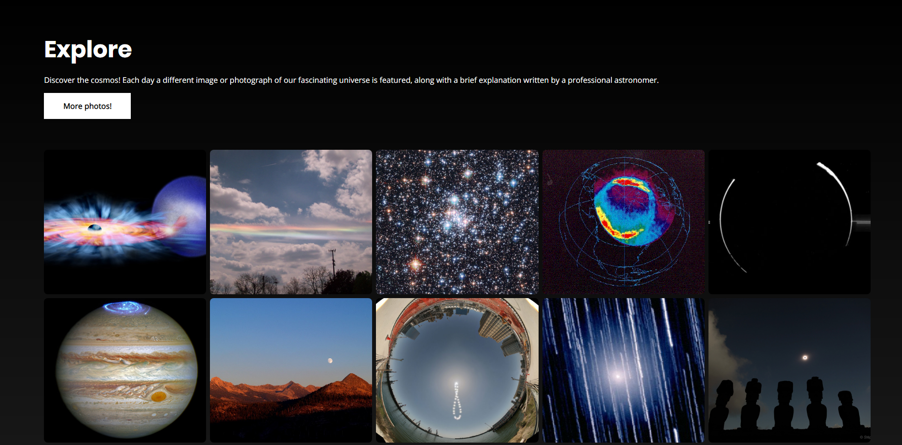

## :bookmark_tabs: Sobre
> Discover the cosmos! Each day a different image or photograph of our fascinating universe is featured, along with a brief explanation written by a professional astronomer. 

Inspirado no aplicativo [Orbit](https://github.com/rbmelolima/Orbit "Orbit"), criei o Explore, um site que reune diversas fotos disponibilizadas pela NASA pela API da APOD.

[Acesse o Explore em seu navegador](https://www.rbmelolima.com.br/Explore/)

## :hammer: Instalando

````bash
# Clone este projeto
$ git clone https://github.com/rbmelolima/Explore

# Instale as dependências
$ yarn 

# Obtenha sua chave de acesso à API e subtitua a existente na pasta /src/key/index.js

# Inicie a aplicação
$ yarn start
````

## :rocket: APOD

> One of the most popular websites at NASA is the Astronomy Picture of the Day. In fact, this website is one of the most popular websites across all federal agencies. It has the popular appeal of a Justin Bieber video. This endpoint structures the APOD imagery and associated metadata so that it can be repurposed for other applications. In addition, if the concept_tags parameter is set to True, then keywords derived from the image explanation are returned. These keywords could be used as auto-generated hashtags for twitter or instagram feeds; but generally help with discoverability of relevant imagery.

#### Utilizando a API

Antes de mais nada, vá até o site das [APIs públicas da NASA](https://api.nasa.gov/) e obtenha sua chave de acesso com um simples cadastro. 

Com a chave em mãos, você poderá realizar as seguintes requisições:

**Foto do dia**

`https://api.nasa.gov/planetary/apod?api_key=DEMO_KEY`

**Foto de uma data específica**

`https://api.nasa.gov/planetary/apod?api_key=DEMO_KEY&date=2001-10-30`

**Array de fotos em datas aleatórias**

`https://api.nasa.gov/planetary/apod?api_key=DEMO_KEY&count=75`

**Array de fotos de um determinado intervalo de tempo**

`https://api.nasa.gov/planetary/apod?api_key=DEMO_KEY&start_date=2017-07-05&end_date=2017-07-10`

**Exemplo de retorno**

    // 20200712140709
    // https://api.nasa.gov/planetary/apod?api_key=DEMO_KEY&date=2017-07-12
    
    {
      "copyright": "Hubble Legacy Archive",
      "date": "2017-07-12",
      "explanation": "A bright spiral galaxy of the northern sky, Messier 63 is about 25 million light-years distant in the loyal constellation Canes Venatici. Also cataloged as NGC 5055, the majestic island universe is nearly 100,000 light-years across. That's about the size of our own Milky Way Galaxy. Known by the popular moniker, The Sunflower Galaxy, M63 sports a bright yellowish core in this sharp composite image from space- and ground-based telescopes. Its sweeping blue spiral arms are streaked with cosmic dust lanes and dotted with pink star forming regions. A dominant member of a known galaxy group, M63 has faint, extended features that are likely star streams from tidally disrupted satellite galaxies. M63 shines across the electromagnetic spectrum and is thought to have undergone bursts of intense star formation.",
      "hdurl": "https://apod.nasa.gov/apod/image/1707/M63-HST-Subaru-LL.jpg",
      "media_type": "image",
      "service_version": "v1",
      "title": "Messier 63: The Sunflower Galaxy",
      "url": "https://apod.nasa.gov/apod/image/1707/M63-HST-Subaru-S1024.jpg"
    }
